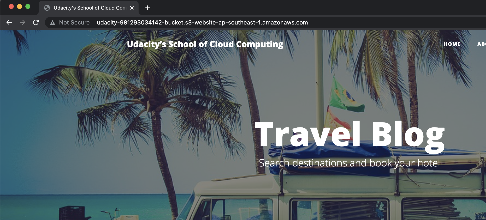

# Project 1: Deploy Static Website on AWS
In this project, you will deploy a static website to AWS by performing the following steps:

1. You will create a public S3 bucket and upload the website files to your bucket.
2. You will configure the bucket for website hosting and secure it using IAM policies.
3. You will speed up content delivery using AWS’s content distribution network service, CloudFront.
4. You will access your website in a browser using the unique CloudFront endpoint.

# RESUBMIT: Mentor Please use these URL below for checking, thank you:
(the exact domain name and the S3 URLs will be different in previous submission)
=== Access these url to check the result:

- d2evc5sv4cjtoi.cloudfront.net
- udacity-981293034142-bucket.s3-website-ap-southeast-1.amazonaws.com
- udacity-981293034142-bucket.s3-website-ap-southeast-1.amazonaws.com/index.html

# Explanation of the files in the repository
1. ```./aws/create_s3.py```: To create aws S3
2. ```./aws/upload_to_s3.py```: To upload html folder to AWS S3
3. ```./aws/set_s3_policy.py```: To uset S3 policy via IAM
4. ```./aws/config_s3_static_website.py```: To config static website on AWS S3
5. ```./aws/create_distribution_cloudfront.py```: To create AWS cloudfront distribution and wait until it be Deployed
6. ```./aws/delete_cloudfront.py```: To clean up AWS cloudfront after using avoid wasting money
7. ```./aws/delete_s3.py```: To clean up AWS S3 after using avoid wasting money
8. ```./config.cfg```: To control global variables that use for this project
9. ```./aws_helper/cloudfront_custom.json```: config file in order to create AWS cloudfront
10. ```./aws_helper/cloudfront_custom_disable.json```: config file in order to disable AWS cloudfront


# Environment set up (In case run locally)
1. Install python environment (version 3.9)
2. Install pandas: ```pip install boto3```
3. Install pyspark: ```pip install botocore```
4. Install AWS CLI via package 

# Prerequisites:
Config AWS credentials 

# Run scripts

1. Create/use IAM user with attach policy ```AdministratorAccess```, ```AmazonS3FullAccess```, ```CloudFrontFullAccess```
2. Manually input AWS  KEY and AWS Secret KEY into ```config.cfg``` 
    
    
3. Unzip ```udacity-starter-website.zip``` inside project1 folder 
    
    
4. Run ```create_s3.py```
    
    
    
5. Run ```upload_to_s3.py```
    
    
    
6. Run ```set_s3_policy.py```
    
    
    
7. Run ```config_s3_static_website.py```
    
    
    
8. Run ```create_distribution_cloud_front.py```
    
    
    
    
9. Check result
    
    
    
    
10. Clean up cloudfront - run ```delete_cloudfront.py```
    
    
    
11. Remove items in bucket and delete bucket - Run ```delete_s3.py```
    
    


