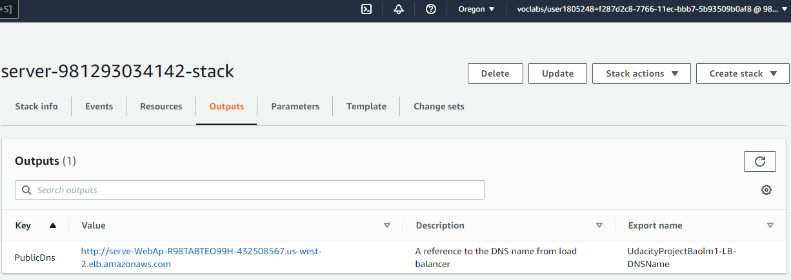

# Project 2: Deploy a high-availability web app using CloudFormation
As your final project, you'll be faced with a real scenario.

Creating this project will give you the hands-on experience you need to confidently talk about infrastructure as code. We have chosen a realistic scenario where you will deploy a dummy application (a sample JavaScript or HTML file) to the Apache Web Server running on an EC2 instance.

There will be two parts to this project:

- Diagram: You'll first develop a diagram that you can present as part of your portfolio and as a visual aid to understand the CloudFormation script.
- Script (Template and Parameters): The second part is to interpret the instructions and create a matching CloudFormation script.

# Udacity Cloud Infrastructure Diagram


```Public URL: http://serve-WebAp-R98TABTEO99H-432508567.us-west-2.elb.amazonaws.com```


# Explanation of the files in the repository
1. ```./network.yml```: Yaml network config file
2. ```./network-parameters.json```: json file to store network parameters 
3. ```./servers.yml```: Yaml server config file
4. ```./server-parameters.json```: json file to store server parameters 
5. ```./create.bat``` or ```./create.sh```: .bat file is used for execution on windows while .sh for linux or macos, to create aws stack (cloud formation)
6. ```./update.bat``` or ```./update.sh```: .bat file is used for execution on windows while .sh for linux or macos, to update aws stack (cloud formation)
7. ```./delete.bat``` or ```./delete.sh``: .bat file is used for execution on windows while .sh for linux or macos, to delete aws stack (cloud formation)


# Environment set up (In case run locally)
1. Install AWS CLI via package 

# Prerequisites:
1. Create/use IAM user with attach policy ```AdministratorAccess```, ```AWSCloudFormationFullAccess```
2. Config AWS credentials and use default region us-west-2

# Run scripts

1. Navigate to folder store yaml file and parameters json file ```cd project2-deploy-web-with-cloudformation```
2. Execute ```create.bat <stack-network-name> network.yml network-parameters.json```
3. Wait until network stack create complete 


4. Execute ```create.bat <stack-server-name> server.yml server-parameters.json```
5. Wait until server stack create complete 


6. Check server output to get public url


7. Access public url on browser to verify the result


# Clean scripts
1. ```delete.bat <stack-server-name>```
2. Wait until server stack delete complete 
3. ```delete.bat <stack-network-name>```


