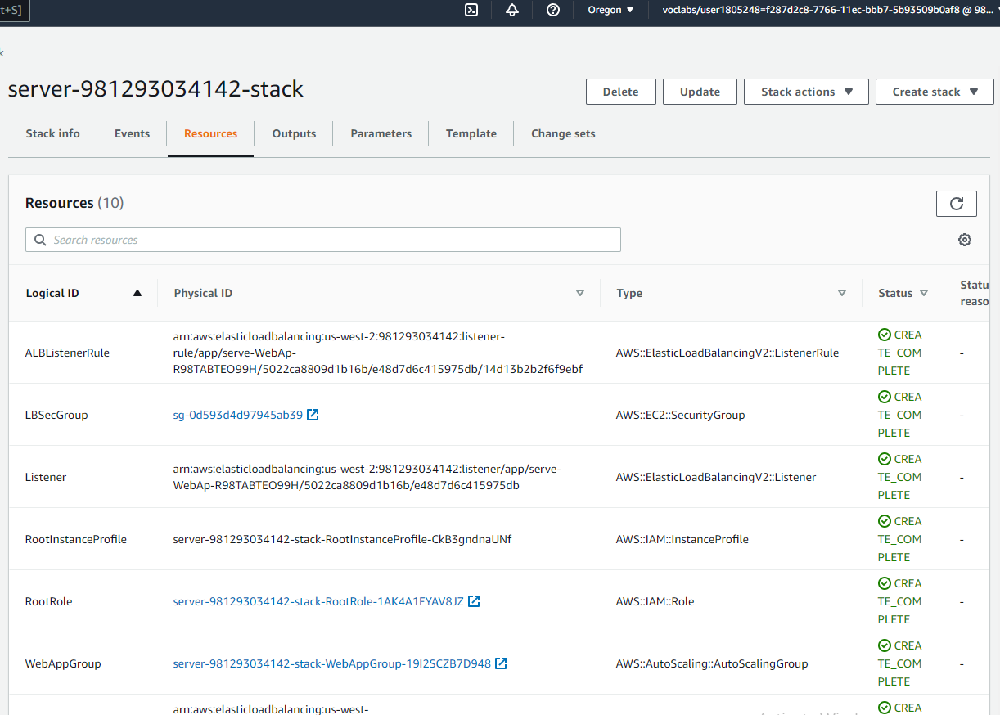

# Project 1: Deploy Static Website on AWS
In this project, you will deploy a static website to AWS by performing the following steps:

1. You will create a public S3 bucket and upload the website files to your bucket.
2. You will configure the bucket for website hosting and secure it using IAM policies.
3. You will speed up content delivery using AWS’s content distribution network service, CloudFront.
4. You will access your website in a browser using the unique CloudFront endpoint.

# Udacity Cloud Infrastructure Diagram


```Public URL: http://serve-WebAp-R98TABTEO99H-432508567.us-west-2.elb.amazonaws.com```


# Explanation of the files in the repository
1. ```./network.yml```: Yaml network config file
2. ```./network-parameters.json```: json file to store network parameters 
3. ```./servers.yml```: Yaml server config file
4. ```./server-parameters.json```: json file to store server parameters 
5. ```./create.bat``` or ```./create.sh```: .bat file is used for execution on windows while .sh for linux or macos, to create aws stack (cloud formation)
6. ```./update.bat``` or ```./update.sh```: .bat file is used for execution on windows while .sh for linux or macos, to update aws stack (cloud formation)
7. ```./delete.bat``` or ```./delete.sh``: .bat file is used for execution on windows while .sh for linux or macos, to delete aws stack (cloud formation)


# Environment set up (In case run locally)
1. Install AWS CLI via package 

# Prerequisites:
1. Create/use IAM user with attach policy ```AdministratorAccess```, ```AWSCloudFormationFullAccess```
2. Config AWS credentials and use default region us-west-2

# Run scripts

1. Navigate to folder store yaml file and parameters json file ```cd project2-deploy-web-with-cloudformation```
2. Execute ```create.bat <stack-network-name> network.yml network-parameters.json```
3. Wait until network stack create complete 


4. Execute ```create.bat <stack-server-name> server.yml server-parameters.json```
5. Wait until server stack create complete 




6. Check server output to get public url


7. Access public url on browser to verify the result


# Clean scripts
1. ```delete.bat <stack-server-name>```
2. Wait until server stack delete complete 
3. ```delete.bat <stack-network-name>```


